# Prompt Engineering Workshop

Prompt engineering is a tedious process that involves a lot tasks and components.  Developments have next determine what the input or prompts are going to be and what the actions we want in return.  In order to achieve, there are a lot of parts.  For instance, the prompts are responses need to be tokenize.  Next, depending on that the action that will be the output, we need to identify where that information is coming from.  Is the information coming from an API, or an LLM model?  When data is returned, does it need preprocessing?  How is the best response identify?


That’s where Azure Prompt Flow, is valuable if providing a user-friendly logical flow to structure the different tasks involves and their dependencies.  To understand how to utilize Prompt Flow to expedite process of using an LLM that takes input and generates.  We are going to use a dental clinic’s virtual chat agent takes input from users and provides an answer.  Since using OpenAI or any other LLM model is not going to know specific information about our Contoso dental client, we are going to use data for our clinic.


**Custom Data**:

👩🏽‍💻 | After the workshop, you learn how to:

-	Chat flow that takes input and produces output while keeping a dialog history.
-	Take custom data (in csv file) and convert the data into tokenized embeddings with vector indexes.
-	Use the LLM tool to create prompts and the response
-	Use the embedding tool to the trained embeddings model to search the vector index
-	Use the Python tool to create custom functions to preprocess data or call an API 
-	Use the Prompt tool to format the output response.


## ✅ |Prerequisites:
To complete this workshop, you need the following:
1. Login or Signup for a [Free Azure account](https://azure.microsoft.com/free/)
2. GitHub account with access to GitHub Codespaces.
3. Install Python 3.8 or higher.

# Getting Started using GitHub Codespaces

To get started quickly, you can use a pre-built development environment. **Click the button below** to open the repo in GitHub Codespaces, and then continue the readme!

[](https://codespaces.new/Azure/azure-prompt-flow?quickstart=1)  

This will launch a Codespaces environment with all the dependencies installed.  Once the environment is ready, you can run the following commands to create the Azure resources and run the sample code.

**Note**: You can also access the codespaces by clicking on the green **Code** button in the top right of the repo.  Then selecting the "Codespaces" tab and clicking on the **Create codespace on main** button to launch the Codespaces environement.


This will launch a Codespaces environment with all the dependencies installed.  Once the environment is ready. This will take ~ 10 minutes.  


On the environment is ready, a Visual Studio Code editor will open.


First, set the python environment to Python 3.8

```shell
conda activate py38_env
```

At the commmand prompt, authenticate to Azure by running the following command:

```shell
az login --use-device-code
```

Enter the code provided in the browser to authenticate to Azure.  Once authenticated, you need to set your Azure subscription.

```shell
az account set --subscription <your-subscription-id>
```


## Create Azure resource

Now, we are ready to run the setup create the Azure resources, run the following command:

```shell
bash setup.sh
```

The setup creates the following Azure resources:

-	Create Azure OpenAI
-	Add deployment OpenAI models
-	Create Azure ML workspace
-	Create Azure ML compute
-	Create Azure ML custom environment
-	Launch AzureML studio

## Access Connection data
Before we can run promptflow, we’ll need to retrieve details on the Azure OpenAI API instance provisioned in your Azure account.

Azure OpenAI
1.	Open the [Azure portal](http://portal.azure.com/), in the search box type **Azure OpenAI**, then press enter to search your resource.
2.	Click on Azure OpenAI from the list of services.  You should see your OpenAI name list on the Azure AI Services page for Azure OpenAI


3.	Click on your OpenAI instance.
4.	Under Resource Management, select the Keys and Endpoint on the left-hand side of the navigation bar
5.	Copy **Key 1** and the **Language APIs URL**.  Store both values in a clipboard for later use


 
6.	Click on Overview on the left-hand side of the navigation bar.
7.	On the Overview page, click on the Explore button
8.	Click on Deployments on the left side of the navigation
9.	Copy both the deployment name for the gpt-35-turbo model and text-embedding-ada-002

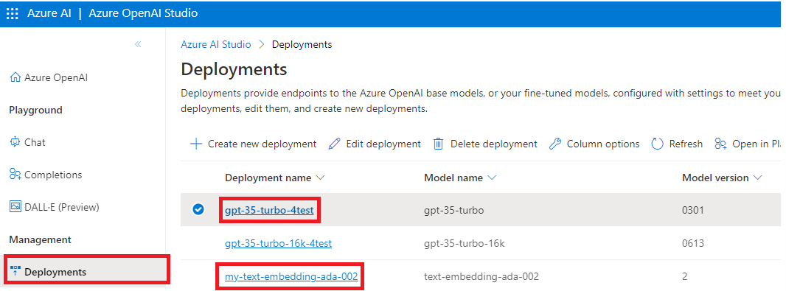
	  
11.	 Close the browse tab for the Azure OpenAI Studio


## Add Flow connections

As you work on creating Flows, it may have dependencies, services or external resources that you would need to connect to; such as OpenAI, Content Safety AI or your custom LLM models.  It enables users to add and manage connection to these resources as well as a their connection secrets (e.g. name, api key, api_endpoint, or type).  

We’ll add the connection for Azure OpenAI API.  

1.	Open the browser the tab for the GitHub Codespaces for Visual Studio Code.

2.  Run the following command to create a connect to Azure OpenAI:

```shell
pf connection create --file connection/openai.yml --set api_key=your_api_key --name open_ai_conn
```

## Bring your own data

Open AI and most LLM models are training from various publicly available data.  However, there are instances where we need to use our own data and narrow the actions and data search of our LLM prompts to focus only on the scope of our data or expand the data from LLM model to include our data as well.  To use your own data in a LLM, you need to convert you data into numeric values.  Each word mapping to a specific number (token).  Then you train a model to find similarities, collations, or word association, the model creates vector indexes to the word associations.   The good thing is the Prompt Flow service provide an easy-to-use process your to upload dataset and it generates model and the Vector indexes.

To upload custom data for this lab, you need to use the Contoso Dentist clinic data located in *data/contoso_dental.xls*.

1.	Open the *src/create_faiss_mlindex.ipynb* notebook in the Visual Studio Code editor.
2.	Click on the **Select Kernel** button.


3.	Select **Python Environment** from the drop-down menu.  Then pick the condo **Python 3.8** kernel.
4. Before running the notebook, you need to replace the following placeholders with values with your Azure OpenAI connection details:
* **os.environ["AOAI_CONNECTION_NAME"]**:  Replace with your prompt flow connection name you created above.
* **os.environ["AOAI_API_KEY"]**:  Replace with your Azure OpenAI API key.
* **os.environ["AOAI_ENDPOINT_URL"]**:  Replace with your Azure OpenAI API endpoint.
os.environ["TEXT_EMBEDDING_DEPLOYMENT_NAME"]:  Replace with your Azure OpenAI deployment name for the text-embedding-ada-002 model.
5. Next, you need to upload your *config.json* file to the Azure ML workspace.  To do this, open [Azure ML studio](https://ml.azure.com/).
6. On the right corner the page, click on the down arrow.Click on the **Download config file** button.  

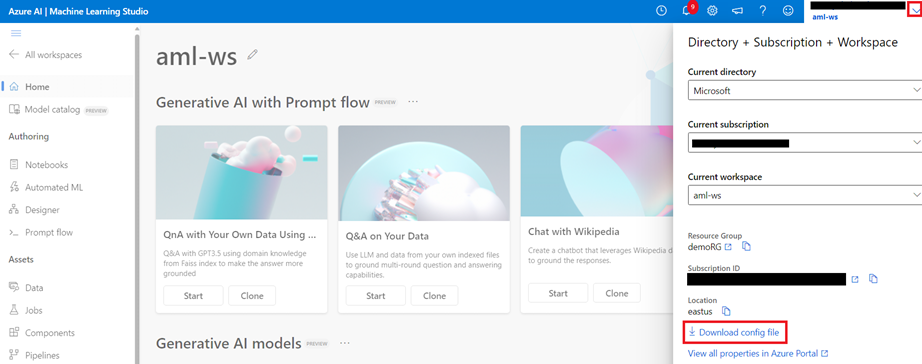

7. Then browse to the download **config.json** file in your local director.  In the Visual Studio Code editor, click on the *src* folder and upload or paste the *config.json* to the directory.


8. Click on the **Run All** button on the top of the notebook to run the notebook.
9. It take ~10 for the notebook to running.
10. Click on the **Link to Azure Machine Learning studio** click in the notebook to open the Azure ML job pipeline.


11. On the left-hand side of the page, click on the **Data** open.
12. Under the **Data sources**, click **dental_faiss_mlindex** to open the vector data.
13. Finally copy the **Datastore URI** value.  We’ll use this value in the next exercise.

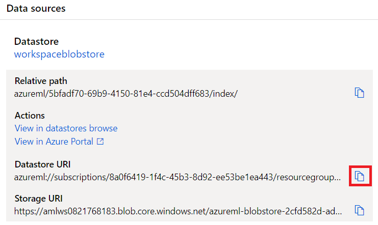

## Run Chat template

Azure Machine Learning studio promptflot provide a gallery of flows templates to build on.  We will start by using a basic chat template that interacts with prompts powered by an OpenAI model.

1.	In Visual Studio code editor, expand the **my-chatbot** folder.  Then open on the **flow.dag.yaml** file. 
2.	Scroll to the top of the file and click on the **Visual editor** option to open the logical flow graph.

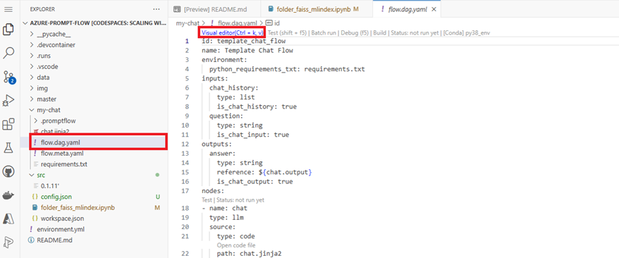

*Input Node*

On flow page, promptflow generates the Input fields need for the chat input node.  The inputs needed for the chat node are **chat_history** and **question**.  

Add Azure OpenAI connection for the Chat 

1.	Under the **chat** section on the right-side of the file, click on the **Add connection** button.

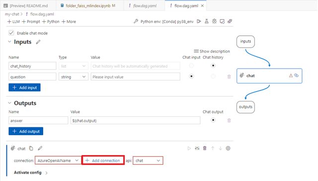

2. Select the **AzureOpenAI** option on top of the page.


3. Enter a **name** for the connection 
4. For the **api_base**, enter your Azure OpenAI API endpoint url you copied earlier.
5. Save the file.
6. Click on **Create connection** 

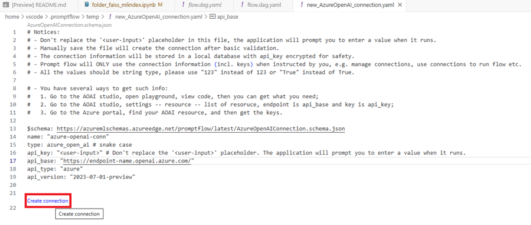

7. Copy and paste the azure openai key you copied earlier in the **api_key** command prompt.


8. The api_key will be stored in the **secrets** section of the flow file.  This will enable you to use the api_key in other nodes in the flow.


9. Open the **flow.dag.yaml** file.  In the **chat** section, select connection name you just created in the **connection** drop-down menu.

10. For the **deployment_name**, enter the deployment name for the **gpt-35-turbo** model you copied earlier.


*Output Node*

If you scroll back to the Output section, you’ll see that the **answer** is linked to the Chat nodes output.

*Run the Chat*

1.	To test the Chat flow, click on the **Run** icon


2. On top of the page, select **Run it with interactive mode (text-only)** option.


 
3. Enter the input below for the **User** prompt and click enter.

```shell
what's a tooth cavity?
```


4.	Finally, enter the input below for the **User** prompt and click enter.

```shell
What is the address of your dental clinic?
```


 
As you can see the Chat is not able to answer specific questions about a business or dental clinic.   This makes some of the answers not reliable or available.  In the next exercise, you learn how to bring your custom data into the chat to provide response that are relevant to your data.

## Create Chat agent to use custom data.
In the precise exercise you create a vector index and train to search for your vector embeddings.  In the exercise, you’ll be expanding the Chat pipeline logic to take the user question and convert to numeric embeddings.  Then we’ll use the numeric embedding to search the numeric vector.  Next, we’ll use the prompt to set rules with restrictions and how to display the data to the user.

We'll be using the following tools:
-	**Embedding**: converts text to number tokens.  Store to token in vector arrays based on then relation to each other.
-	**Vector index lookup**: Takes user input question and queries the vector index with the closest answers to the question.
-	**Prompt**: enters user to add rules on the response show be sent to user
-	**LLM**: provides the LLM prompt or LLM model response to user
 
1.	Open Prompt Flow service for Visual Studio code, by clicking the icon.


2.	On the **TOOLS** toolbar, select the **Embedding** tool by clicking on plus icon **+**.  


 
3.	Enter **Name** for the node (e.g. embed_question) in the pop-up entry on top of the page. Then press **Enter**.  This will generate a new Embedding section at the bottom of the flow.

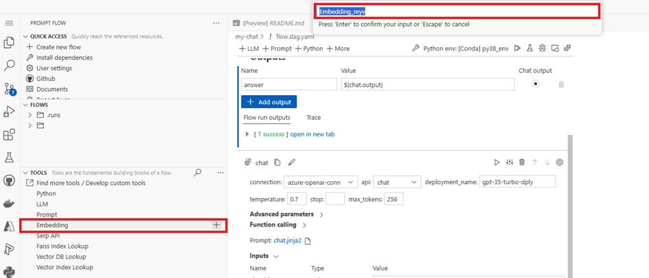

4.	Select the **AzureOpenAIconnection** name you created earlier.
5.	Select **Text-embedding-ada-002** deployment name you created earlier
6.	For **Input**, select *${inputs.question}*.  This should create a node under the input node.


 
* Vector Index Lookup*

1.	On the **TOOLS** toolbar, select the **Vector Index Lookup** tool by clicking on plus icon **+**.  
2.	Enter **Name** for the node (e.g. search_vector_index).  This will generate a new **Vector Index Lookup** section at the bottom of the flow.
3.	For **Path**, copy and paste the Datastore URI you retrieve earlier for the vector index.
4.	Select the embedding output as the **query** field (e.g. *${embed_question.output}*).
15.	Leave default value for **top_k**.

**NOTE**: Feel free move the nodes around to make it easier to view the flow.


 
*Construct Prompt*

1.	On the **TOOLS** toolbar, select the **Prompt** tool by clicking on plus icon **+**.  This will generate a new Prompt section at the bottom of the flow.
2.	Enter a **Name** for the node (e.g. generate_prompt).  This will generate a new Prompt section at the bottom of the flow.
3. Click on the **.jinja2** link to open the prompt editor.  This will open a new tab in the editor.
4.	Delete all the text in the file.  Then, copy the following text in the Prompt textbox:
```bash
system:
You are an AI system designed to answer questions. When presented with a scenario, you must reply with accuracy to inquirers' inquiries.  If there is ever a situation where you are unsure of the potential answers, simply respond with "I don't know.  

context: {{contexts}}


user:
{{item.inputs.question}}
assistant:
{{item.outputs.answer}}


user:
{{question}}
```


5.	Close the .jinja2 prompt editor tab.  Then return to the flow.dag.yaml tab.
6. In your prompt section of the flow, you would see the prompt flow automatically generated the input fields from the placeholder fields in your .jinja2 file.
7.	Select ${inputs.question} for the **question** field.
8.	For **contexts**, select ${Search_Vector_Index.output}.
9.	Select the ${inputs.chat_history} for **chat_history**


*chat*

1.	Click on the **chat** node and drag it below the **generate_prompt** node.

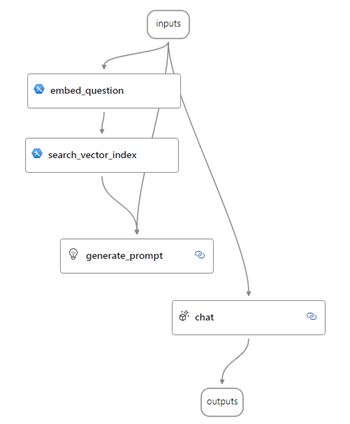
 
2.	Click on the **chat** to scroll up to the *chat* section.
3. Click on the **.jinja2** link for the chat to open the prompt editor.  This will open a new tab in the editor.

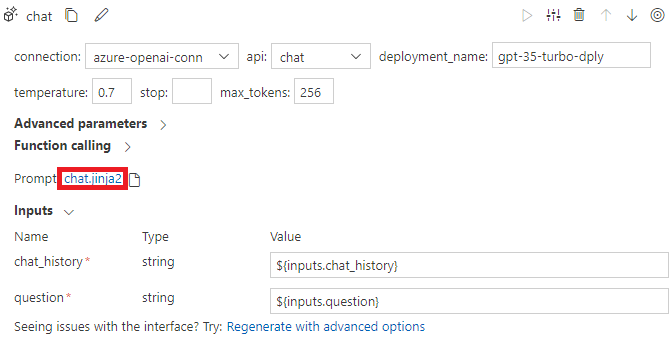

4.	Delete all the text in the file.  Then, copy and paste the following text in the Prompt textbox.  This specifies the output to display to the user:
```bash
{{prompt_response}}
```
5.	Close the .jinja2 prompt editor tab.  Then return to the flow.dag.yaml tab.
6. In your chat section of the flow, you would see that prompt flow automatically generated a **prompt_response** input fields from the placeholder fields in your .jinja2 file.
7.	In the *prompt_response* value, select ${generate_prompt.output}.


## Test Chat with your own data

Now that you have updated the prompt flow logic to you use your own data and process the output, let’s see if the Chat will generate relevant information pertaining to our Contoso dental data.  

*Run the Chat*

1.	To test the Chat flow, click on the **Run** icon
2. On top of the page, select **Run it with interactive mode (text-only)** option. 
3. Enter the input below for the **User** prompt and click enter.

```shell
what is your dental clinic address?
```

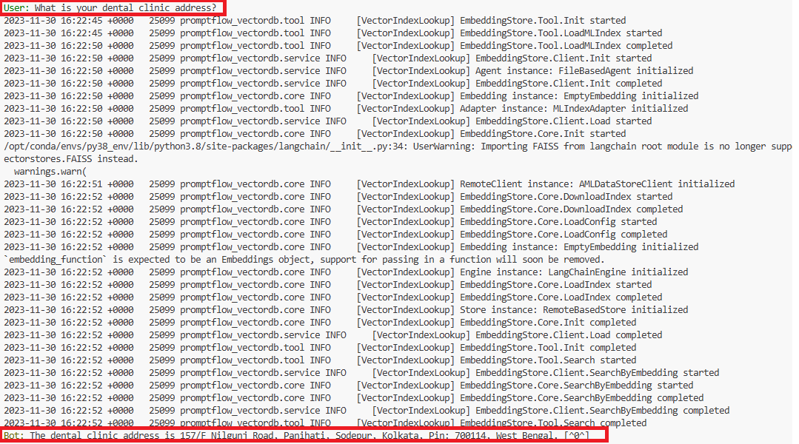

4.	Finally, enter the input below for the **User** prompt and click enter.

```shell
what is your dental clinic's phone number?
```

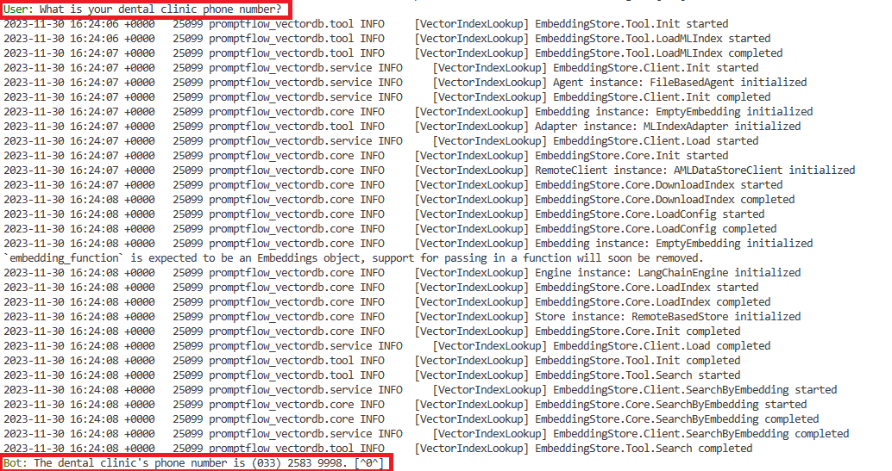
 
5.	Now, let's try a question that is not in our data to test if AI chatbot is grounded our custom data. Enter the following question:

```shell
Who is the author of Hamlet?
```
6.	You should get the following response:

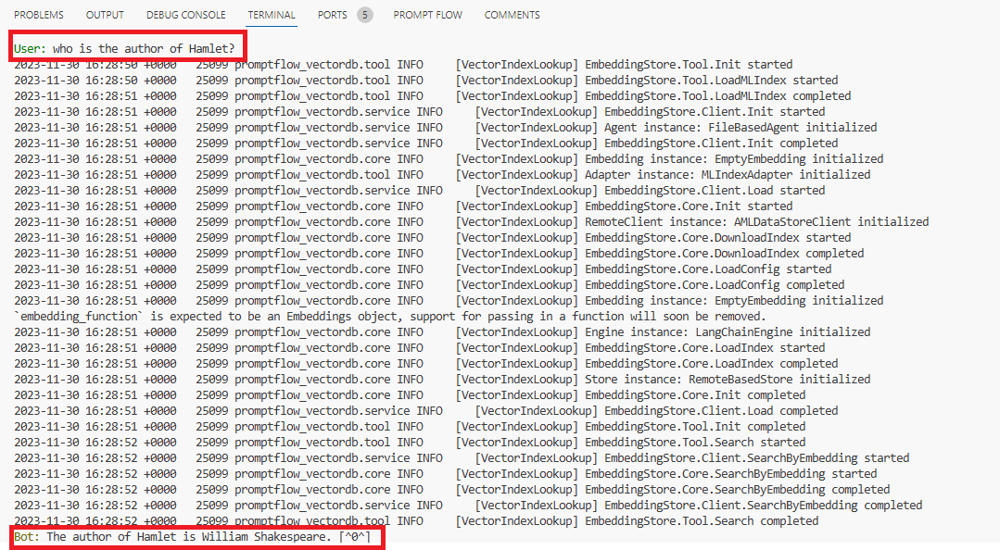

As you can see, our chat produces a response that is factual but *Hamlet* not in our Contoso dental data.As you can see Hamlet is not is our contoso dental data. This show that our chatbot is has problems still grounded to our data.  In the next exercise, we’ll learn how to use the prompt engineering to add rules to our chatbot to restrict its response.

Handle Groundedness issues

Always an LLM model may be eager to provide the user with a response.  It’s important to make sure that the model is not providing response to questions that are out of scope with subject domain of your data.  Another issue is the response may provide information that is not factual and, in some cases, even provide reference to the answer that appears legitimate.  This is a risk, because the information provided to the user can have negative or harmful consequences.

*Grounding outputs*

1. Open the **flow.dag.yaml** file.  In the **promt** section, 
2. Click on the **.jinja2** link to open the prompt editor.  This will open a new tab in the editor.
4.	Modify the **system** text.  Then, copy the following text:
```bash
system:
 You are an AI system designed to answer questions from users in a designated context. When presented with a scenario, you must reply with accuracy to inquirers' inquiries using only descriptors provided in that same context. Only provided information in the vector index scope. If there is ever a situation where you are unsure of the potential answers, simply respond with "I don't know.
Please add citation after each sentence when possible in a form. 
```


5. Close the .jinja2 prompt editor tab.  Then return to the flow.dag.yaml tab.
6. To test the Chat flow, click on the **Run** icon. Then select **Run it with interactive mode (text-only)** option.
7. Now, let's enter the following question again:

```shell
Who is the author of Hamlet?
```

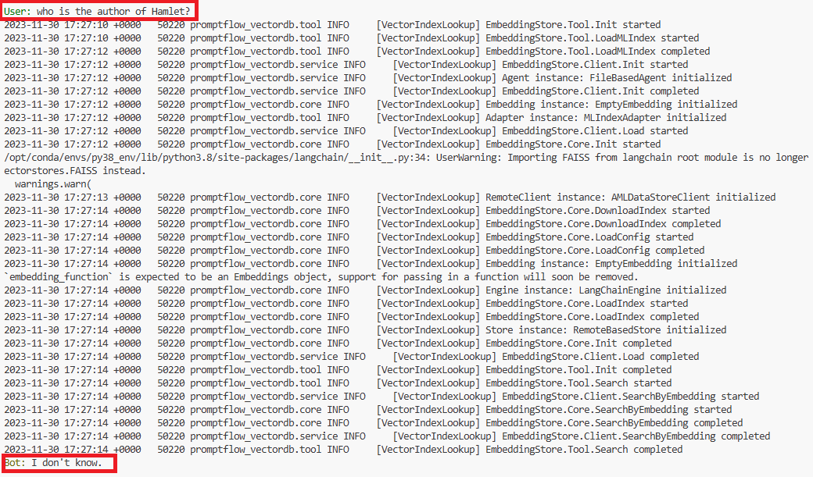

As you can see, the chatbot is now responding with “I don’t know” when the question is not in our vector index for contoso dental.

8. Let's verify again the address our the dental clinic.  Enter the following question:

```shell
what is the dental clinic address?
```

7.	Finally, enter the following question:

```shell
My tooth is aching really bad.  What could be the cause?
```
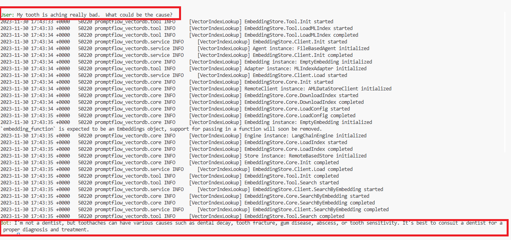
 

## Evaluate your Flow
You can unit test your Flow.  However, Prompt flow provides a gallery of sample evaluation flows your can use to test you Flow in bulk.  For example, classification accuracy, QnA Groundedness, QnA Relevant, QnA Similarity, QnA F1 Score etc.  This enables you to test how well your LLM is performing.  In addition, you have the ability to examine which of your variant prompts are performing better.   In this example, we’ll use the QnA Groundedness evaluation template to test our flow.

1.	Click on the **Evaluate** on the top right-side of the screen.


 
2.	On the Basic settings page, select the **Use default variant for all nodes** radio button.
3.	Click the **Next** button
4.	On the Batch run settings page, click on **Add new data** link for the **Data** field.
5.	Enter **Name** on the Add new data pane (e.g. Contoso-Dental)
6.	**Browse** to the workshop repo directory and select the **contoso-dental.csv** file.   
7.	Click on the **Add** button.   A preview of the top 5 rows of the data should be displayed at the bottom of the page.
8.	Under Input mapping, enter the open and close brackets **[]** for the value of **chat_history**.
9.	Click in the Value textbox for the **question** field and enter ${data.question}.

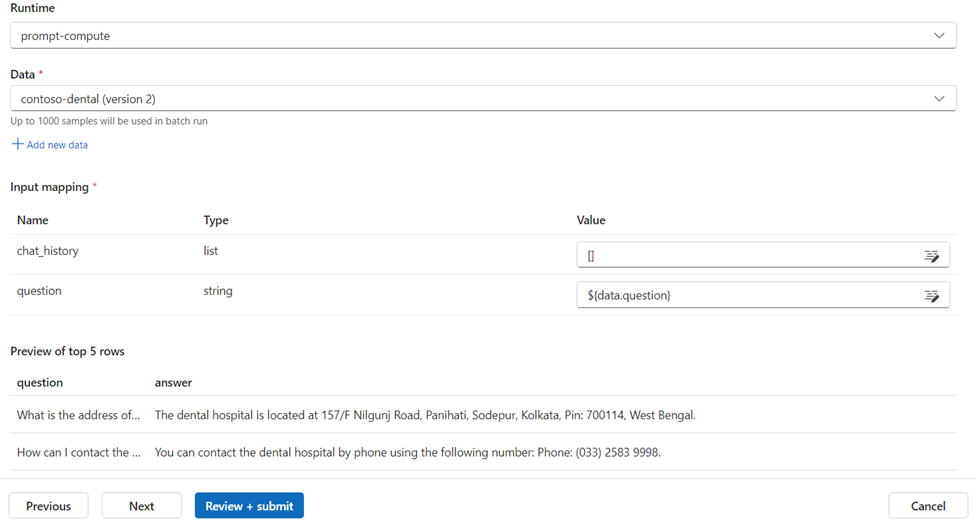
 
10.	Click the **Next** button.
11.	On the **Select evaluation** page, select the checkbox for the **QnA Groundedness Evaluation**.

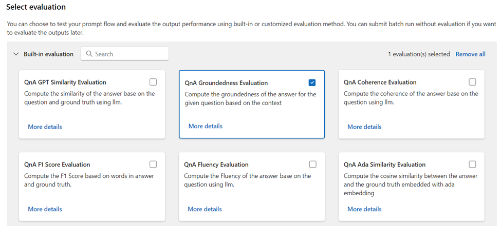
 
12.	Click the **Next** button.
13.	Click on the right arrow **“>”** to expand the **QnA Groundedness Evaluation** settings.


 
14.	Click on the Data Source textbox and enter ${data.question} for the question field. 
15.	Enter ${run.inputs.contexts} for the context field.
16.	Enter ${run.outputs.answer} for the answer field.
17.	On the right-hand side of the page, scroll down to the bottom of the page.
18.	Select your AzureOpenAI connection name for the Connection.
19.	 For Deployment name / Model, select your AzureOpenAI deployment name.
 
 

20.	Click the Next button. 
21.	Finally, click on the Submit button.
22.	Click on View run list to monitor the run progress.


 
23.	Click the Refresh button to update the run status. The run should take ~15 minutes.
24.	Click on the Display name of the run to view the run results.
25.	Click on View outputs.  Then select the run name from the Append related results option.
26.	The results will include a column for gpt_groundedness score.

 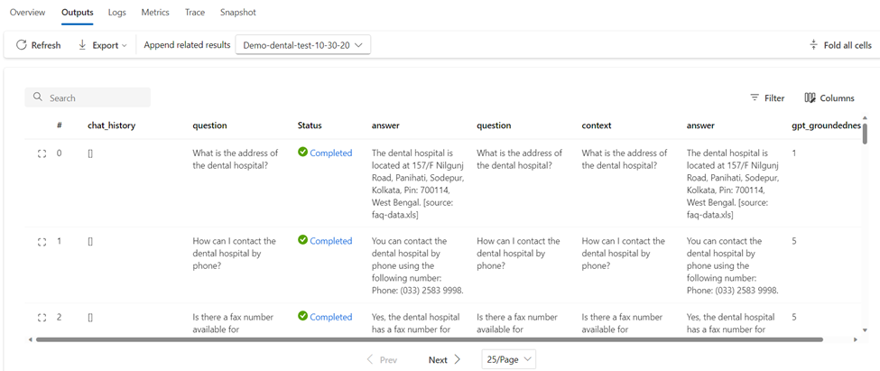

27.	The score will range from 1 to 5, where 1 is the worst and 5 is the best performance.


